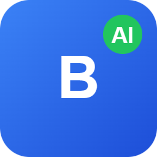

# 🚀 BryanAI - Sistema de Otimização de Currículo com IA

<p align="center">
  
</p>

<p align="center">
  <a href="https://github.com/AndradeTK/BryanAI"></a>
  
  
  
  
</p>

Sistema completo para **análise de compatibilidade com vagas** e **geração de currículos otimizados para ATS**, utilizando inteligência artificial do Google Gemini.

## 📋 Índice

- [Funcionalidades](#-funcionalidades)
- [Screenshots](#-screenshots)
- [Tecnologias](#️-tecnologias)
- [Instalação](#-instalação)
  - [Via Docker (Recomendado)](#via-docker-recomendado)
  - [Instalação Manual](#instalação-manual)
- [Extensão Chrome](#-extensão-chrome)
- [API Reference](#-api-reference)
- [Estrutura do Projeto](#-estrutura-do-projeto)
- [Como Usar](#-como-usar)
- [IA - Personas](#-ia---personas)
- [Troubleshooting](#-troubleshooting)
- [Contribuindo](#-contribuindo)
- [Licença](#-licença)

## ✨ Funcionalidades

| Feature | Descrição |
|---------|-----------|
| 📊 **Dashboard** | Visão geral do currículo com estatísticas de completude |
| 📝 **CRUD Completo** | Gerenciamento de Perfil, Experiências, Formação, Cursos e Idiomas |
| 🎯 **Análise Job Fit** | Score de 0-100 de compatibilidade usando IA |
| ✍️ **Currículo Otimizado** | Geração automática com palavras-chave relevantes para ATS |
| 📄 **Export PDF/DOCX** | Conversão com layout profissional |
| 🧩 **Chrome Extension** | Captura vagas do LinkedIn, Gupy, Indeed e outros |
| 📧 **Cover Letter** | Geração de cartas de apresentação personalizadas |
| 🌐 **Multi-idioma** | Suporte a PT-BR, Inglês e Francês |
| 📜 **Histórico** | Rastreamento de todas as gerações com visualização de PDFs |

## 📸 Screenshots

As imagens de exemplo não estão incluídas neste repositório. Se quiser adicionar screenshots, crie a pasta `docs/screenshots/` e adicione os arquivos `dashboard.png`, `jobfit.png` e `extension.png`.

## 🛠️ Tecnologias

| Categoria | Tecnologia |
|-----------|------------|
| **Backend** | Node.js 20+ / Express.js 4.x |
| **Banco de Dados** | MySQL 8.0+ com connection pooling |
| **Frontend** | EJS + Tailwind CSS 3.x |
| **IA** | Google Gemini (default: `gemini-2.0-flash`) |
| **PDF** | Puppeteer |
| **DOCX** | html-to-docx |
| **Extensão** | Chrome Extension Manifest V3 |
| **Container** | Docker + Docker Compose |

## 🚀 Instalação

### Via Docker (Recomendado)

```bash
# Clone o repositório
git clone https://github.com/AndradeTK/BryanAI.git
cd BryanAI

# Configure as variáveis de ambiente
cp .env.example .env
# Edite o .env com suas configurações

# Inicie com Docker Compose
docker-compose up -d --build
```

Acesse: http://localhost:3000

### Instalação Manual

#### 1. Clone e instale as dependências

```bash
git clone https://github.com/AndradeTK/BryanAI.git
cd BryanAI
npm install
```

#### 2. Configure o banco de dados

Crie um banco MySQL e execute o script SQL:

```bash
mysql -u root -p < infos_curriculo.sql
```

#### 3. Configure as variáveis de ambiente

```bash
cp .env.example .env
```

Edite o `.env`:

```env
# Servidor
PORT=3000
NODE_ENV=development

# MySQL
DB_HOST=localhost
DB_PORT=3306
DB_USER=seu_usuario
DB_PASSWORD=sua_senha
DB_NAME=infos_curriculo

# Google Gemini AI
GEMINI_API_KEY=sua_chave_api_aqui
```

> 💡 **Obter API Key do Gemini**: Acesse [Google AI Studio](https://aistudio.google.com/app/apikey)


#### 4. Inicie o servidor

Certifique-se de ter instalado as dependências antes de iniciar o servidor:

```bash
# Instale dependências (necessário antes de iniciar)
npm install

# Produção
npm start

# Desenvolvimento (com auto-reload)
npm run dev
```

Acesse: http://localhost:3000

## 🧩 Extensão Chrome

### Instalação da Extensão

1. Abra `chrome://extensions/` no Chrome
2. Ative o **Modo do desenvolvedor** (canto superior direito)
3. Clique em **Carregar sem compactação**
4. Selecione a pasta `chrome-extension/`

### Uso da Extensão

1. Navegue até uma vaga no LinkedIn, Gupy, Indeed, etc.
2. Clique no ícone da extensão BryanAI
3. Clique em **📋 Capturar Vaga** para extrair título e descrição
4. Clique em **🎯 Analisar** para ver o Job Fit Score
5. Clique em **📄 Baixar PDF** para gerar currículo otimizado

### Sites Suportados

- ✅ LinkedIn Jobs
- ✅ Gupy
- ✅ Indeed
- ✅ Glassdoor
- ✅ Vagas.com.br
- ✅ Catho
- ✅ InfoJobs

## 📡 API Reference

### Currículo

| Método | Endpoint | Descrição |
|--------|----------|-----------|
| GET | `/api/curriculo/completo` | Dados completos do currículo |
| GET | `/api/curriculo/validar` | Validação e completude |

### Job Fit

| Método | Endpoint | Descrição |
|--------|----------|-----------|
| POST | `/api/jobfit/quick` | Análise rápida (score + resumo) |
| POST | `/api/jobfit/analyze` | Análise completa |
| POST | `/api/jobfit/generate` | Gera currículo otimizado |

**Exemplo de Request:**

```json
POST /api/jobfit/quick
{
  "titulo": "Desenvolvedor Full Stack",
  "descricao": "Requisitos: Node.js, React, MySQL..."
}
```

**Exemplo de Response:**

```json
{
  "success": true,
  "data": {
    "score": 85,
    "fit": "Excelente Match",
    "resumo": "Perfil altamente compatível com a vaga..."
  }
}
```

### Conversão

| Método | Endpoint | Descrição |
|--------|----------|-----------|
| POST | `/converterhtmltopdf` | Converte HTML para PDF |
| POST | `/converterhtmltodocx` | Converte HTML para DOCX |
| GET | `/api/arquivos/:filename` | Download de arquivo gerado |
| GET | `/api/arquivos/:filename/view` | Visualização inline do PDF |

### CRUD (Entidades)

Disponível para: `perfil`, `experiencias`, `formacao`, `cursos`, `idiomas`

| Método | Endpoint | Descrição |
|--------|----------|-----------|
| GET | `/api/{entidade}` | Listar todos |
| GET | `/api/{entidade}/:id` | Buscar por ID |
| POST | `/api/{entidade}` | Criar novo |
| PUT | `/api/{entidade}/:id` | Atualizar |
| DELETE | `/api/{entidade}/:id` | Deletar |

## 📁 Estrutura do Projeto

```
BryanAI/
├── app.js                    # Servidor Express
├── package.json              # Dependências
├── docker-compose.yml        # Configuração Docker
├── Dockerfile                # Build da aplicação
├── .env.example              # Template de variáveis
├── infos_curriculo.sql       # Schema do banco
│
├── config/
│   └── database.js           # Pool MySQL
│
├── controllers/
│   ├── DashboardController.js
│   ├── PerfilController.js
│   ├── ExperienciaController.js
│   ├── FormacaoProjetoController.js
│   ├── EducacaoCursoController.js
│   ├── IdiomaController.js
│   ├── JobFitController.js
│   └── ConversaoController.js
│
├── models/
│   ├── Perfil.js
│   ├── Experiencia.js
│   ├── FormacaoProjeto.js
│   ├── EducacaoCurso.js
│   ├── Idioma.js
│   └── HistoricoGeracao.js
│
├── services/
│   ├── aiAnalyzer.js         # Análise Job Fit com Gemini
│   ├── aiWriter.js           # Reescrita de currículo
│   ├── curriculoService.js   # Agregação de dados
│   └── documentConverter.js   # Conversão PDF/DOCX
│
├── routes/
│   ├── web.js                # Rotas de páginas
│   └── api.js                # API REST
│
├── views/
│   ├── layout.ejs
│   ├── partials/
│   ├── dashboard/
│   ├── perfil/
│   ├── experiencias/
│   ├── formacao/
│   ├── cursos/
│   ├── idiomas/
│   ├── jobfit/
│   └── templates/
│       └── curriculo.ejs     # Template do currículo
│
├── public/
│   ├── css/
│   └── js/
│
├── generated/                # PDFs/DOCXs gerados
│
└── chrome-extension/
    ├── manifest.json         # Manifest V3
    ├── popup.html            # Interface da extensão
    ├── popup.js              # Lógica do popup
    ├── content.js            # Captura de vagas
    ├── content.css           # Estilos injetados
    └── icons/
```

## 📖 Como Usar

### 1. Configure seu perfil básico
Acesse a seção **Perfil** e preencha seus dados pessoais e objetivo profissional.

### 2. Adicione suas experiências
Cadastre experiências com descrições detalhadas de realizações e resultados.

### 3. Complete sua formação
Adicione formação acadêmica e projetos relevantes.

### 4. Registre cursos e certificações
Inclua cursos técnicos e certificações da área.

### 5. Informe idiomas
Adicione idiomas e seus níveis de proficiência.

### 6. Analise vagas com Job Fit
Use a extensão Chrome ou a interface web para:
- Colar a descrição da vaga
- Obter o score de compatibilidade
- Identificar gaps e pontos fortes

### 7. Gere currículos otimizados
Com base na análise, gere currículos personalizados:
- Palavras-chave estrategicamente posicionadas
- Formato otimizado para sistemas ATS
- Export em PDF ou DOCX

## 🤖 IA - Personas

O sistema utiliza duas personas especializadas do Gemini:

### 📊 Recrutador Técnico Sênior (Análise)

> *"15+ anos de experiência em Tech Recruiting, especialista em triagem técnica"*

- Analisa compatibilidade real vs. requisitos
- Identifica gaps de habilidades
- Pontua de 0-100 com justificativas

### ✍️ Engenheiro de ATS (Escrita)

> *"Especialista em otimização de currículos para ATS"*

Usa a **Fórmula Mágica**:
```
[Verbo de Ação] + [Tarefa] + [Resultado Quantificável]
```

- Posiciona palavras-chave estrategicamente
- Mantém formato ATS-friendly
- Traduz para o idioma selecionado

## 🔧 Troubleshooting

### Erro: "chrome-extension://invalid/"

Este erro geralmente é causado por **outra extensão** com problemas, não pelo BryanAI. Para verificar:

1. Abra `chrome://extensions/`
2. Desative outras extensões uma por uma
3. Verifique qual está causando o erro

### Botão "Capturar Vaga" não funciona

1. **Recarregue a página** de vagas após instalar a extensão
2. Verifique se o site é suportado (LinkedIn, Gupy, etc.)
3. Abra o **DevTools (F12)** e veja o Console por mensagens `[BryanAI]`
4. Atualize a extensão em `chrome://extensions/` clicando em 🔄

### Erro de conexão com servidor

1. Verifique se o servidor está rodando: `npm start`
2. Confirme a URL em **Config** na extensão: `http://localhost:3000`
3. Teste a conexão clicando em **Testar**

### Gemini API Error

1. Verifique se `GEMINI_API_KEY` está configurada no `.env`
2. Confirme que a API Key é válida em [AI Studio](https://aistudio.google.com/)
3. Verifique limites de uso da API

### Erro de banco de dados

1. Confirme que o MySQL está rodando
2. Verifique as credenciais no `.env`
3. Execute o script: `mysql -u root -p < infos_curriculo.sql`

## 🤝 Contribuindo

1. Fork o projeto
2. Crie uma branch: `git checkout -b feature/nova-funcionalidade`
3. Commit suas mudanças: `git commit -m 'Add nova funcionalidade'`
4. Push para a branch: `git push origin feature/nova-funcionalidade`
5. Abra um Pull Request

## 📝 Licença

Este projeto está licenciado sob **CC BY-NC 4.0** (uso não comercial). Veja [LICENSE](LICENSE) para detalhes sobre direitos e restrições.

---

<p align="center">
  Desenvolvido por <a href="https://github.com/AndradeTK">AndradeTK</a>
  <br>
  Powered by <strong>Node.js</strong> e <strong>Google Gemini AI</strong>
</p>
